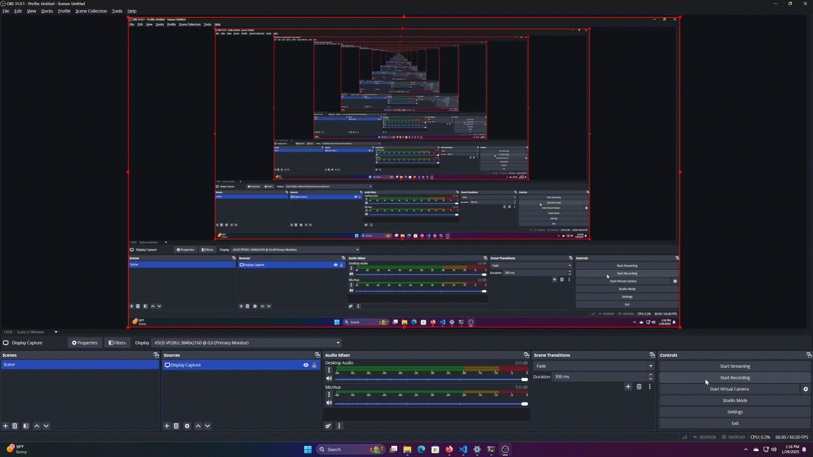

[](https://classroom.github.com/a/tp86o73G)
[](https://classroom.github.com/open-in-codespaces?assignment_repo_id=17744419)

# Installation
Install net-tools for ifconfig
```sh
$ sudo apt install net-tools
```

# Usage
## Shell Script
```sh
$ ./macdaddy.sh -i eth0 -a 55:d9:73:08:af:e7
$ ./macdaddy.sh -i wlan1 -a 6e:4f:12:e4:77:e3
$ ./macdaddy.sh -i enp0s3 -r
$ ./macdaddy.sh -i eth0 -u
$ ./macdaddy.sh -i wlan1 -u
$ ./macdaddy.sh enp0s3 -u
```
```sh
Usage: ./macdaddy.sh [-i <eth0|eth1|...>] [-a <mac-address>] [-r] [-u]
    Examples:
         ./macdaddy.sh -i   eth0 -r
         ./macdaddy.sh -i enp0s3 -a 97:1a:d9:aa:a6:fd
         ./macdaddy.sh -i  wlan1 -u

    Options:
        -i        Network interface           (Always required)
        -a        Mac Address                 (Required unless using -r or -u)
        -r        Randomizes your mac address (Not required)
        -u        Resets your mac address     (Not required)
```
## Python Script
```sh
$ python3 macdaddy.py -i eth0 -a 55:d9:73:08:af:e7
$ python3 macdaddy.py -i wlan1 --address 6e:4f:12:e4:77:e3
$ python3 macdaddy.py -i enp0s3 -r
$ python3 macdaddy.py -i eth0 --undo
$ python3 macdaddy.py -i wlan1 -u
$ python3 macdaddy.py enp0s3 -u
```
```sh
Usage: python3 macdaddy.py [-i <eth0|eth1|...>] [-a <mac-address>] [-r] [-u]
    Examples:
        python3 macdaddy.py -i   eth0 -r
        python3 macdaddy.py -i enp0s3 -a 97:1a:d9:aa:a6:fd
        python3 macdaddy.py -i  wlan1 -u

    Options:
        -h, --help             Shows this message          (Not required)
        -i, --interface        Network interface           (Always required)
        -a, --address          Mac Address                 (Required unless using -r or -u)
        -r, --randomize        Randomizes your mac address (Not required)
        -u, --undo             Resets your mac address     (Not required)
```

# Error Handling/Validation
Checks the given mac address to see if it follows the specified format of 6 base 16 numbers with commas inbetween them
-- I should probably check for valid interfaces

# Troubleshooting
Double check your mac address by going to a regex website and using the regex pattern "^[0-9A-Fa-f]{2}(:[0-9A-Fa-f]{2}){5}$" and the mac address. See if it matches.
Use wireshark to check what your active interface is.
If you reset your computer then try to use the undo option an error will be produced because the fill will not exist due to being in the tmp folder. Also, resetting will reset your mac address back to normal anyway.


# Demonstration

